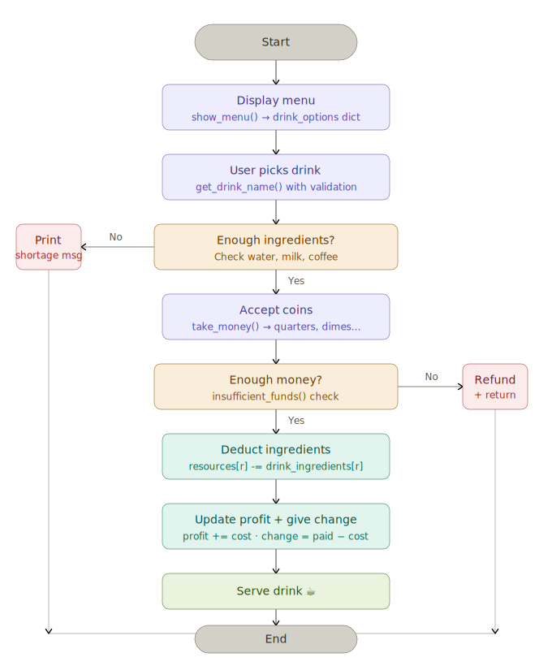

# Day 14: Coffee Machine

A command-line coffee machine simulator written in Python. The program lets a user choose a drink, checks whether there are enough ingredients, accepts coin input, refunds insufficient payments, returns change, and prepares the selected coffee.

## Program Flow



## Features

- Shows a numbered menu for espresso, latte, and cappuccino.
- Validates the drink choice before continuing.
- Checks available water, milk, and coffee before taking payment.
- Accepts quarters, dimes, nickels, and pennies.
- Rejects negative or non-whole-number coin inputs.
- Refunds the user when the inserted money is not enough.
- Deducts ingredients only after a successful purchase.
- Tracks total profit during the program run.

## Menu

| Drink | Water | Milk | Coffee | Cost |
| --- | ---: | ---: | ---: | ---: |
| Espresso | 50 ml | — | 18 g | ₹1.50 |
| Latte | 200 ml | 150 ml | 24 g | ₹2.50 |
| Cappuccino | 250 ml | 100 ml | 24 g | ₹3.00 |

## How to Run

From the project root:

```bash
python3 day14/coffee_machine.py
```

Or from inside the `day14` folder:

```bash
python3 coffee_machine.py
```

## Example Flow

```text
*** MENU ***
[1] Espresso
[2] Latte
[3] Cappuccino

What would you like to order: 1
How many quarters: 8
How many dimes: 0
How many nickels: 0
How many pennies: 0

Your change ₹0.5
And here's your espresso ☕️. Enjoy!
```

## Python Concepts Practiced

- Dictionaries and nested dictionaries
- Loops
- Functions
- Input validation
- Conditional logic
- Basic arithmetic
- Global state

## File

- `coffee_machine.py`: Main program file.